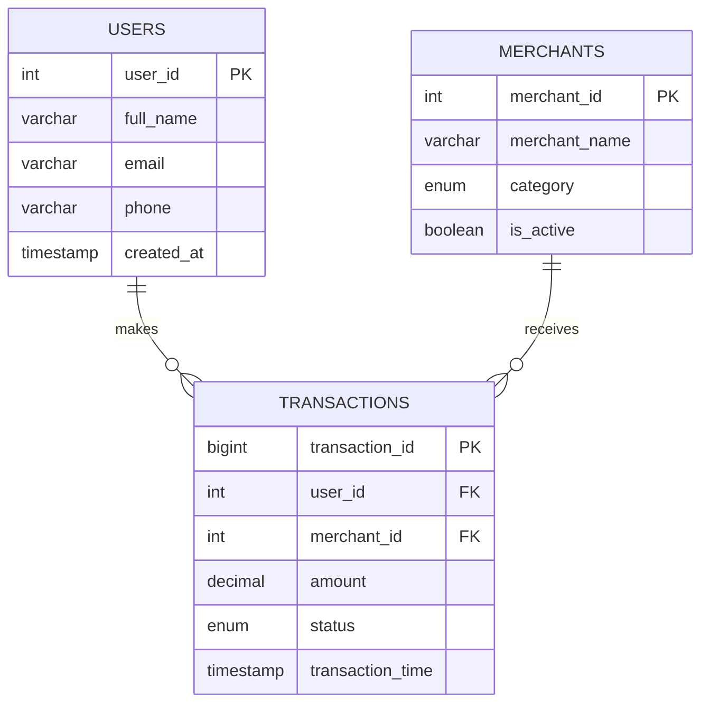

# Dagster-coba-coba

### Entity Relationship Diagram (ERD)

Berikut adalah desain skema database untuk sistem E-Wallet ini. Skema didesain menggunakan pendekatan **3NF (Third Normal Form)** pada sisi transaksional (MySQL) untuk menjamin integritas data.



## Project Structure
## Project Structure

```text
DAGSTER/
├── DDL/                         # SQL scripts / schema definitions
│   ├── CLICK_HOUSE.sql
│   ├── MYSQL_TABLE.sql
│   ├── total_transaction_per_day.sql
│   └── total_transaction_per_merchant.sql
├── env/                         # Virtual environment and dependencies
│   ├── Include/
│   ├── Lib/
│   ├── Scripts/
│   ├── share/
│   └── pyvenv.cfg
├── etl/                         # Main ETL pipeline code (Dagster)
│   ├── __pycache__/
│   ├── Pseudo code/             # Pseudocode or reference logic
│   ├── __init__.py
│   ├── assets.py                # Extract, Transform, Load assets
│   ├── ch.py                    # ClickHouse helper functions
│   ├── db.py                    # Source DB helper functions (MySQL/Mongo)
│   ├── definitions.py           # Pipeline definitions & orchestration
│   ├── mock_data.py             # Dummy / mock data for testing
│   └── test.py                  # Quick tests for ETL assets
├── etl_tests/                   # Unit / integration tests for ETL pipeline
├── output/                      # Output files / temporary results
├── pyproject.toml               # Python project metadata / config
├── README.md                    # Project documentation
├── setup.cfg                    # Setup configuration
└── setup.py                     # Setup script

```
Setup and Running Instructions :

1. Clone the Repository
git clone <your-repo-url>
cd DAGSTER
2. Setup Python Virtual Environment
Create a virtual environment:
python -m venv env
Activate the environment:
Windows (CMD/PowerShell)
.\env\Scripts\activate
3. Install Dependencies
pip install --upgrade pip
pip install -r requirements.txt
If requirements.txt does not exist, generate it:
pip freeze > requirements.txt
4. Configure Database Connections
- Update etl/db.py with MySQL/MongoDB credentials.
- Update etl/ch.py with ClickHouse credentials.
- Ensure the databases are running and accessible.
5. Run DDL Scripts
ClickHouse:
clickhouse-client --query="SOURCE 'DDL/CLICK_HOUSE.sql';"
MySQL:
mysql -u <username> -p <database_name> < DDL/MYSQL_TABLE.sql
6. Run ETL PipelineOption 
Using Dagster CLI:
dagster dev
Open http://localhost:3000 in browser
Run or schedule pipelines in etl/definitions.py
7. Using Mock Data
Use etl/mock_data.py for testing without real DBs.
Update db.py/ch.py if needed.
8. Environment Variables (Optional)
export MYSQL_USER=<user>
export MYSQL_PASSWORD=<password>
export CLICKHOUSE_USER=<user>
export CLICKHOUSE_PASSWORD=<password>
11. Deactivate Environment
deactivate


Alur Transformasi Data di Pipeline Dagster
1. Extract (Ingestion Layer)
Tujuan: Mengambil data mentah dari berbagai sumber.
Sumber Data:
Users → MySQL (mocked di pipeline)
Merchants → MySQL (mocked)
Transactions → MongoDB (mocked)
Incremental Logic:
Untuk Transactions, pipeline hanya mengambil data baru berdasarkan transaction_time terakhir yang tersimpan di ClickHouse.
Ini menjaga pipeline tidak menduplikasi data lama.

2. Transform (Processing Layer)

Langkah-langkah utama:
Flatten Metadata JSON:
Kolom metadata di MongoDB dipecah menjadi:
- device_type → tipe perangkat (misal: mobile, web)
- promo_code → kode promosi yang digunakan

Kategorisasi Amount:
Jumlah transaksi dikategorikan menjadi:
- High Value ≥ 1.000.000
- Medium Value ≥ 100.000
- Low Value < 100.000

Rename dan Standarisasi Kolom:
- _id dari MongoDB diubah menjadi transaction_mongo_id
- Tipe kolom dijaga agar sesuai dengan ClickHouse (contoh: transaction_time menjadi DateTime)
Tambahkan ingestion_time:
- Menyimpan waktu pipeline mengeksekusi transformasi untuk tracking & audit
Cleanup:
- Kolom mentah seperti metadata dihapus
- Kolom diurutkan agar sesuai dengan struktur tabel ClickHouse (fact_transactions)
Output:
Data sudah bersih, lengkap, dan sesuai DDL ClickHouse, siap dimasukkan ke warehouse.

3. Load (Warehouse Layer)
Langkah-langkah:
- Pastikan tabel fact_transactions sudah ada (DDL check).
- Konversi nilai NaN atau None agar ClickHouse menerima.
- Masukkan data dengan library clickhouse_connect.
- Jika tidak ada data baru (empty dataset), insert dilewati, sehingga pipeline aman dijalankan berkali-kali.


Change Data Capture (CDC) dan Batch Processing
Kapan Menggunakan Batch vs. CDC
- Batch processing cocok digunakan ketika data tidak berubah terlalu sering, atau pipeline analitik tidak membutuhkan update real-time. Contohnya, laporan harian atau agregasi mingguan. Batch biasanya lebih sederhana dan mudah diimplementasikan, tapi ada latency karena data baru baru muncul di sistem downstream setelah batch dijalankan.
- CDC lebih tepat digunakan ketika data harus diperbarui secara cepat di sistem target, misalnya sistem analitik real-time, dashboard live, atau   aplikasi yang membutuhkan data terbaru untuk pengambilan keputusan. CDC mengurangi duplikasi data dan network load karena hanya mengirim perubahan, bukan seluruh dataset.
