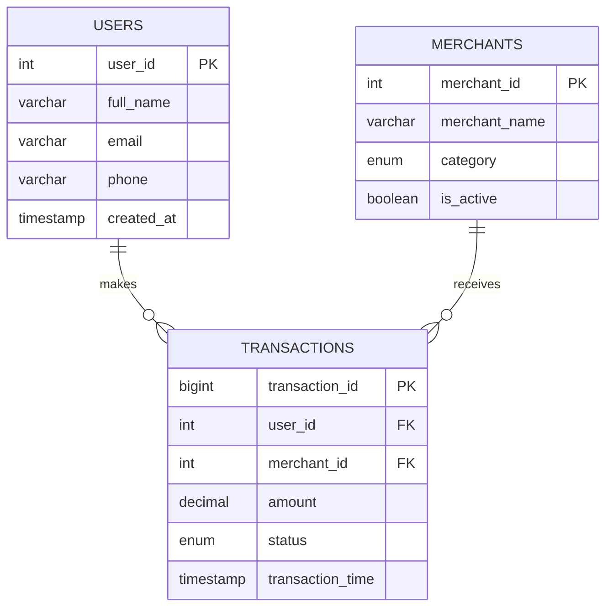

# Dagster-coba-coba

### Entity Relationship Diagram (ERD)

Berikut adalah desain skema database untuk sistem E-Wallet ini. Skema didesain menggunakan pendekatan **3NF (Third Normal Form)** pada sisi transaksional (MySQL) untuk menjamin integritas data.

